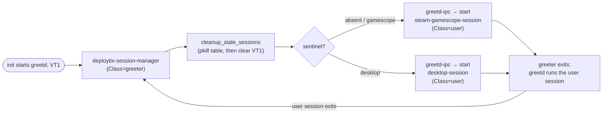
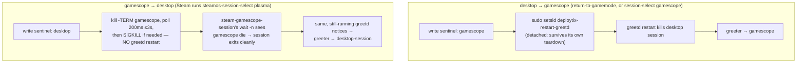

# Deploytix Session Switching — Implementation Reference

Audience: AI agents and humans working on the gamescope ⇄ desktop session-switching
subsystem. This is the **architecture and contract reference**: what exists, how the
pieces interact, which invariants must never be broken, and how to deploy changes.
The narrative history of how each design decision was reached (with the bugs that
forced it) lives in `docs/SESSION_SWITCHING_REWORK.md`; read that before changing
anything non-trivially.

Everything in this document was verified against a live deploytix handheld install
on 2026-09-05/06, including a full root-cause investigation of a broken
"Switch to Desktop" (§7.3).

---

## 1. System context

A deploytix gaming install is a SteamOS-like handheld system built on:

- **Artix Linux** — no systemd. Init is runit, OpenRC, s6, or dinit.
- **greetd** — the display manager, on VT1, supervised by the init system.
- **gamescope** — Wayland compositor for Game Mode (Bazzite-maintained fork, built
  from `vendor/gamescope`).
- **Steam** in `-gamepadui -steamos3 -steampal -steamdeck` mode — the Deck-style UI.
- **A desktop environment** (KDE Plasma / GNOME / XFCE) for Desktop Mode.
- **seatd or elogind** — seat management. The session scripts pick
  `LIBSEAT_BACKEND` adaptively (elogind running → `logind`, `/run/seatd.sock` →
  `seatd`).
- **Immutable btrfs layout** (usually): `/` and `/usr` are read-only subvolume
  snapshots; see §8 before trying to modify any deployed file.

There is **no systemd-logind session orchestration**. The entire session lifecycle
is greetd + shell scripts + a sentinel file.

## 2. The Steam ⇄ OS contract

How Steam invokes a desktop session from inside Game Mode — verified from live logs,
not inferred:

1. The user picks **Power → Switch to Desktop** in the gamepad UI.
2. Steam draws a fullscreen **"Switching to Desktop"** overlay.
3. Steam executes **`steamos-session-select plasma`** as a child process, resolved
   via `PATH`. (The argument observed from current clients is `plasma`; treat the
   set `{plasma, desktop, gamescope}` as open — old/new clients vary.)
4. Steam **discards the exit code** and does nothing else. No D-Bus, no logind, no
   compositor interaction. It simply waits to be killed by the session teardown the
   script is expected to trigger.

Consequences:

- If the script fails or the teardown stalls, Steam sits on the overlay forever.
  A frozen "Switching to Desktop" on screen can also mean *gamescope died but the
  next compositor never presented* — the panel keeps scanning out gamescope's last
  frame (see §7.3).
- The script must log its own invocation (`session-select` writes every raw call to
  `~/.local/state/deploytix-session-select.log` *before* validating anything),
  because Steam gives no feedback whatsoever.
- Steam launched with `-steamdeck` also probes SteamOS tooling; the stubs
  `steamos-update` (exit 7 = no update), `jupiter-biosupdate` (exit 0), and
  `steamos-select-branch` must exist in `/usr/bin` or the OOBE/update checks hang.

Other integration facts agents get wrong:

- **Base layer**: gamescope in `--steam` mode renders nothing until
  `GAMESCOPECTRL_BASELAYER_APPID` is set to `769` on the X root window (done via
  `xprop` right after gamescope reports ready).
- **Steam client layout**: the bootstrap tarball ships only `steam.sh` + the 32-bit
  launcher. The real client arrives on first run:
  `ubuntu12_64/steamwebhelper` (64-bit CEF renderer) and **`ubuntu12_32/steamui.so`**
  (dlmopen'd by the 32-bit `steam` binary). `steamui.so` does **not** exist in
  `ubuntu12_64/` on a fully-updated client — a client-installed check against
  `ubuntu12_64/steamui.so` never passes and forces the bootstrap path on every boot.
- Steam is single-instance via `~/.steam/steam.pipe`; a dead client that left the
  pipe behind makes later launches exit silently.

## 3. Component inventory

Source of truth: `src/resources/session_switching/*` — embedded into the deploytix
binary via `include_str!` in `src/configure/session_switching.rs` and written at
install time by `setup_session_switching()` (`DEPLOY_FILES`, `GENERATED_FILES`).

| Deployed path | Source | Role |
|---|---|---|
| `/etc/greetd/config.toml` | `configure::greetd` | `vt = 1`; `default_session.command = "deploytix-session-manager"`, `user = <autologin user>` |
| `/usr/bin/deploytix-session-manager` | `deploytix-session-manager.sh` | greetd greeter: stale-process cleanup, read sentinel, start the chosen session via greetd IPC |
| `/usr/bin/greetd-ipc` | `greetd-ipc.py` | Python greetd IPC client (`create_session` → `start_session`) so sessions get `Class=user`, not the greeter's revoked seat |
| `/usr/local/bin/steam-gamescope-session` | `steam-gamescope-session.sh` | Game Mode session: gamescope + Steam lifecycle |
| `/usr/local/bin/desktop-session` | rendered from `desktop-session.sh` template | Desktop Mode session wrapper (per-DE generated; see below) |
| `/usr/bin/session-select` | `session-select.sh` | Write sentinel + end the current session (the switch mechanism) |
| `/usr/bin/steamos-session-select` | symlink → `session-select` | What Steam actually calls |
| `/usr/bin/return-to-gamemode` | `return-to-gamemode.sh` | Desktop-side switch back to Game Mode |
| `/usr/bin/deploytix-restart-greetd` | `deploytix-restart-greetd.sh` | Init-agnostic greetd restart (runit `sv`, OpenRC `rc-service`, s6 `s6-svc`/`s6-rc` on `greetd-srv`, dinit `dinitctl`); detects init by runtime state dir, not installed binaries |
| `/usr/bin/steamos-update`, `/usr/bin/jupiter-biosupdate`, `/usr/bin/steamos-select-branch` | stubs | satisfy Steam `-steamdeck` probes; log their invocations |
| `/usr/bin/steam-login-check` | `steam-login-check.sh` | exit 0 iff `loginusers.vdf` has a remembered account |
| `/usr/bin/steam-first-login` + `/etc/xdg/autostart/deploytix-steam-first-login.desktop` | | desktop-side windowed Steam sign-in, auto-returns to gamemode |
| `/etc/pam.d/greetd`, `/etc/pam.d/greetd-greeter` | | PAM services; without `greetd-greeter`, pam falls through to deny-all `other` and the greeter respawn-loops |
| `/etc/polkit-1/rules.d/50-deploytix-networkmanager.rules` | templated | passwordless NetworkManager control for the session user (Steam OOBE network page) |

`desktop-session` is **generated** (`render_desktop_session`): the template's
placeholders (`@DEPLOYTIX_DESKTOP_CMD@`, `@DEPLOYTIX_DESKTOP_FALLBACKS@`,
`@DEPLOYTIX_DE_PROCS@`) are substituted per configured DE. Rendering is pure —
same config, same bytes. The pre-generator hand-written version that ran for four
months is preserved at `ref/desktop-session.sh` as the behavioral baseline; it is
never deployed.

## 4. The sentinel protocol

A single file selects the next session:

- **Path**: `${XDG_CONFIG_HOME:-$HOME/.config}/deploytix-session`
- **Values**: `gamescope` or `desktop` (single word, newline-terminated)
- **Writers**: `session-select` (both directions; normalizes Steam's `plasma` →
  `desktop`), `return-to-gamemode` (`gamescope`), `steam-gamescope-session`
  (`desktop`, first-login fallback when Steam exits with no remembered account)
- **Consumer**: `deploytix-session-manager`, which reads it, **deletes it**, and
  defaults to `gamescope` when absent. One-shot by design: a crash loop can never
  get pinned to a stale selection.

## 5. Session lifecycle

### 5.1 Boot / every greeter cycle



greetd itself provides the loop: when the user session's process tree exits, greetd
restarts the greeter. **No polling, no while-loop, no daemon restarts needed** for
the normal cycle.

### 5.2 Game Mode session (`steam-gamescope-session`)

Ordered phases, each of which exists for a reason:

1. Redirect all output to `~/.local/state/steam-gamescope-session.log`.
2. Pick `LIBSEAT_BACKEND` (elogind → logind, else seatd). Export
   `XDG_SESSION_TYPE=wayland`, `XDG_CURRENT_DESKTOP=gamescope`,
   `XDG_SESSION_DESKTOP=gamescope`; ensure `XDG_RUNTIME_DIR`.
3. GPU/Steam env (`ENABLE_GAMESCOPE_WSI=1`, refresh limits, `LD_PRELOAD` for
   gamemode/latencyflex if present).
4. `dbus-launch` a session bus (survives gamescope restarts).
5. Create the **ready-fd socket** and stats FIFO in a `mktemp -d` under
   `XDG_RUNTIME_DIR`; claim the `gamescope-stats` symlink under an flock.
6. Start gamescope backgrounded:
   `gamescope -w W -h H -f --steam --xwayland-count 2 --force-windows-fullscreen
   --force-grab-cursor ... -R <socket> -T <stats>`; run `audio-startup`
   (never fatal) in parallel.
7. **Block on the ready socket**: gamescope writes `DISPLAY` and
   `GAMESCOPE_WAYLAND_DISPLAY` there when it is actually up. Export them,
   `dbus-update-activation-environment`, set base layer appid 769 via `xprop`.
8. Install the cleanup trap (§6.4).
9. Wait (bounded, 45 s) for a default route — Steam's first act is a client update.
10. If `_steam_client_installed` fails (`ubuntu12_64/steamwebhelper` +
    `ubuntu12_32/steamui.so`), run a plain windowed `steam` to bootstrap the client
    (bounded 15 min), then kill it and remove `steam.pipe`/`steam.pid`.
11. Launch `steam -gamepadui -steamos3 -steampal -steamdeck` backgrounded.
12. **`wait -n "$steam_pid" "$gamescope_pid"`** — whichever dies first ends the
    session (§6.2). If gamescope died, exit immediately (EXIT trap reaps Steam).
13. First-login fallback: if `steam-login-check` fails after Steam exits, write
    `desktop` to the sentinel.

### 5.3 Switching — the two directions are deliberately asymmetric



Why the asymmetry (this is the core lesson of the whole subsystem — see §6.1):
restarting the greetd daemon kills the session *from outside* while gamescope still
holds the DRM master and two Xwayland servers, and seatd/elogind revokes the seat
mid-teardown. A desktop compositor tears down fast enough to win that race;
gamescope does not.

### 5.4 Desktop Mode session (`desktop-session`, generated)

- Resolves the DE command (configured primary, then fallbacks) and runs it under
  `dbus-run-session`, **backgrounded + `wait`** so signal traps fire immediately.
- Exports **no** `XDG_*` session variables (§6.3).
- On exit/signal: two-phase (`TERM`, then `KILL`) teardown of the DE-specific
  process table (`@DEPLOYTIX_DE_PROCS@`, entries `x:<name>`/`f:<pattern>`) plus
  common targets (Xwayland, pipewire, wireplumber), then kills the
  `dbus-run-session` pid. This guarantees the greetd user session actually exits on
  logout even if a KDE/GNOME subprocess hangs.

## 6. Hard invariants — do not break these

Each of these was learned from a real, reproduced failure. Violating any of them
produces a symptom that looks unrelated at first sight.

### 6.1 gamescope → desktop must kill gamescope **in-session**; never restart greetd for this direction

The verified failure chain when greetd is restarted instead (live logs, 2026-09-05
16:03): greetd teardown → seatd `Disabling seat` / `Session paused` while gamescope
is alive → gamescope's final DRM commit fails
(`drm: finish_drm: drmModeAtomicCommit failed: Permission denied`,
`drmModeRmFB failed: Bad file descriptor`) → gamescope dies without releasing clean
DRM state → the next kwin logs `kwin_wayland_drm: Failed to create framebuffer:
Invalid argument` and **never presents a frame** → the panel keeps scanning out
gamescope's last frame — Steam's "Switching to Desktop" overlay — while plasma runs
blind underneath. The reverse direction (desktop → gamescope via greetd restart) is
safe: gamescope performs a full fresh modeset on startup and desktop compositors
release the seat fast.

### 6.2 `steam-gamescope-session` must wait on **both** Steam and gamescope

`wait -n "$steam_pid" "$gamescope_pid"`. Steam does not reliably exit when its
compositor disappears; waiting on Steam alone leaves the session script (and thus
greetd) wedged forever after gamescope is killed — black screen, no greeter. This
is the enabler for 6.1's in-session kill.

### 6.3 `desktop-session` must export **no** `XDG_*` session variables

`startplasma-wayland` creates the session. Pre-declaring `XDG_SESSION_TYPE=wayland`
tells Qt/KDE components a session already exists and they reach for a
`WAYLAND_DISPLAY` kwin has not created yet. This single change is what broke
"Return to Desktop" in the August 2026 rework. (The gamescope session *does* set
its XDG vars — gamescope needs them; the asymmetry is intentional.)

### 6.4 Signal traps must clean up **and exit**

```sh
trap cleanup EXIT
trap 'cleanup; exit' HUP TERM
```

A signal trap returns control to the interrupted script. With a plain
`trap cleanup EXIT HUP TERM`, a TERM'd session script resumed the bootstrap wait
loop and launched Steam into a session already being torn down (observed in logs as
`Starting Steam` after `Cleanup:`). The idempotence guard (`_cleaned`) makes the
EXIT trap a no-op after a signal path already cleaned up.

### 6.5 The greeter must be fast, side-effect-free, and must never run `steam`

`deploytix-session-manager` runs with a revoked seat and no display. Anything slow
or hanging before the IPC call makes greetd log
`greeter exited without creating a session` and respawn-loop. In particular the
Arch/Artix `steam` wrapper (even `steam -shutdown`) runs the full runtime bootstrap
under `set -e` and hangs from a seatless context — cleanup is `pkill` only.

### 6.6 Steam client presence is `ubuntu12_64/steamwebhelper` + `ubuntu12_32/steamui.so`

Checking `ubuntu12_64/steamui.so` (which never exists) forces the windowed
bootstrap client on *every* boot: Game Mode comes up as a plain Steam window, the
15-minute bootstrap loop runs each session, and switches initiated from that state
race the bootstrap machinery.

### 6.7 Sentinel is one-shot; gamescope is the default

The manager deletes the sentinel after reading. Never make the desktop the implicit
default — a wedged Game Mode must always be recoverable by rebooting into
gamescope, and a wedged desktop by the sentinel/first-login fallback.

### 6.8 On immutable installs, never edit deployed scripts in place

`/usr` is a read-only snapshot; even where `/` happens to be rw, in-place edits
diverge from the transactional model and are lost/shadowed across sets. Deploy via
a new snapshot set (§8.2).

## 7. Diagnostics

### 7.1 Log map (all under `~/.local/state/`)

| Log | Writer | What it answers |
|---|---|---|
| `deploytix-session-select.log` | `session-select` | Did Steam actually invoke the switch, when, with which argv, and which teardown ran? **Ground truth for the Steam contract.** |
| `deploytix-session.log` | session manager | Which session was selected each cycle, IPC success/failure |
| `steam-gamescope-session.log` | gamescope session | gamescope startup/ready, seat backend, bootstrap path, cleanup ordering, gamescope-vs-steam exit |
| `desktop-session.log` | desktop session | DE startup, compositor errors (e.g. kwin framebuffer failures), teardown |
| `steam-first-login.log` | first-login helper | first-boot sign-in flow decisions |
| `~/.local/share/Steam/logs/console-linux.txt`, `console_log.txt`, `bootstrap_log.txt` | Steam | client updates, launch flags, `Fatal Error: Failed to load steamui.so`, `ComputeStartupMode: forcing gamepadui for steamdeck + gamescope` |

### 7.2 Failure playbook

| Symptom | First checks | Likely cause |
|---|---|---|
| "Switching to Desktop" frozen mid-screen | select log has the invocation? `desktop-session.log` shows kwin `Failed to create framebuffer`? gamescope log shows `finish_drm ... Permission denied` after `Disabling seat`? | greetd-restart teardown raced gamescope's DRM release (§6.1). The desktop is probably running invisibly. |
| Switch button "does nothing" | select log empty → Steam never found/ran the script (symlink? PATH?); log has entry but exit 1 → unknown session name | contract breakage (§2) |
| Black screen, no greeter, after killing gamescope | `steam-gamescope-session.log` ends in `wait` on Steam only | §6.2 violated |
| Greeter respawn loop (`greeter exited without creating a session`) | anything slow/hanging in `cleanup_stale_sessions`; missing `/etc/pam.d/greetd-greeter` | §6.5 |
| Every boot shows windowed Steam first / long black waits | `Steam client not present; bootstrapping` in session log while client is installed | §6.6 wrong path check |
| Desktop logout hangs on blank screen | `desktop-session.log` teardown; DE proc table wrong for installed DE | generated `desktop-session` vs actual DE mismatch |
| Steam OOBE hangs at update check | stubs missing/non-executable | §2 stubs |

### 7.3 Worked case study (2026-09-05)

Timeline reconstructed entirely from the logs above: Steam ran
`steamos-session-select plasma` at 16:03:44 → deployed (pre-fix) script restarted
greetd → seat revoked mid-teardown → gamescope died uncleanly → kwin started 2 s
later, failed `drmModeAddFB` (`Invalid argument`), never presented → user stared at
the frozen Steam overlay for 42 minutes while plasma ran blind (apps launched,
logout eventually worked). Control case: the same desktop-session generation worked
minutes earlier when reached through a *normal in-session exit*. Fixes deployed:
in-session gamescope kill (§6.1), `wait -n` both pids (§6.2), client check paths
(§6.6), trap exit semantics (§6.4). Verified working after reboot.

## 8. Making changes

### 8.1 Source of truth and install-time flow

1. Edit `src/resources/session_switching/*.sh` (or the generator in
   `src/configure/session_switching.rs` for `desktop-session`).
2. `bash -n` every touched script.
3. `cargo test` — `session_switching.rs` has regression tests asserting, among
   others: the desktop branch of `session-select` never restarts greetd and the
   gamescope branch still does; spawn ordering; every referenced helper is deployed
   via `DEPLOY_FILES`/`GENERATED_FILES`.
4. The scripts are `include_str!`-embedded: a rebuilt `deploytix` binary carries
   them into future installs. A live system hot-fixed per §8.2 diverges from the
   installer output until the repo change is committed and the package rebuilt —
   always land the repo change too.

### 8.2 Deploying to a live immutable system (transactional)

Never write to the live `/usr`. Replicate `deploytix update`'s transaction
(`src/immutable/update.rs`, `snapshot.rs`, `boot.rs`) — or use `deploytix update`
itself when the change ships as a package. The manual file-deploy variant, verified
end-to-end on 2026-09-05:

```sh
# 0. Identify the RUNNING trio (never assume @): parse rootflags=subvol= from
#    /proc/cmdline; its usr/etc pair is in /.deploytix-pair.
#    Devices: root fs = /dev/mapper/Crypt-Root, usr fs = /dev/mapper/Crypt-Usr
#    (usr fs == root fs on single-partition layouts).

# 1. Create a writable snapshot set from the running trio (id = epoch seconds):
#    mount each fs at subvolid=5, then per fs:
#      btrfs subvolume snapshot <fsroot>/<running-root> <fsroot>/@deploytix-sets/$id/root
#      btrfs subvolume snapshot <fsroot>/<running-etc>  <fsroot>/@deploytix-sets/$id/etc
#      btrfs subvolume snapshot <fsroot>/<running-usr>  <fsroot>/@deploytix-sets/$id/usr
#    and write the pair marker into the set's root:
#      printf 'usr=%s\netc=%s\n' "@deploytix-sets/$id/usr" "@deploytix-sets/$id/etc" \
#        > <set-root>/.deploytix-pair

# 2. Mount the set (root rw + usr rw + etc rw) at /run/deploytix-update/$id and
#    install the files with the manifest's exact modes, e.g.:
#      install -o root -g root -m 755 session-select.sh        $t/usr/bin/session-select
#      install -o root -g root -m 755 steam-gamescope-session.sh $t/usr/local/bin/steam-gamescope-session
#    Verify (diff + ls -l + symlink), then umount -R.

# 3. Activate: mount the set again at /run/deploytix-grub (root ro, usr ro, etc rw,
#    rbind /boot /var), point $t/etc/default/grub's rootflags=subvol= at
#    @deploytix-sets/$id/root, then inside artix-chroot run
#    /usr/local/bin/reinstall-grub (grub-mkconfig + standalone EFI rebuild +
#    SecureBoot re-sign) — a bare grub-mkconfig is NOT enough on standalone-GRUB
#    installs. Finally sync the live /etc/default/grub pointer the same way.

# 4. Reboot to activate. Rollback: `deploytix rollback` or the GRUB snapshot menu
#    (older sets are kept; never prune the running set).
```

Notes: the full `deploytix update` additionally repairs fstab, stages packages via
`pacman` in the mounted set, regenerates the initramfs, and prunes old sets — none
of which a pure script deploy needs. `/var`, `/home`, `/boot` are shared (not
snapshotted), so logs and Steam state persist across sets.

### 8.3 Verification checklist after deploying a switch-related change

1. Boot lands in Game Mode (gamepad UI, not windowed Steam;
   `steam-gamescope-session.log` shows no bootstrap phase when a client exists).
2. Steam → Switch to Desktop: select log shows the invocation **and**
   `ending session: killing gamescope`; the DE takes the screen (no frozen
   overlay); `desktop-session.log` shows no `Failed to create framebuffer`.
3. Desktop → Return to Gamemode: greetd restart path; gamescope comes back.
4. Desktop logout (no helper): greeter restarts into gamescope (sentinel default).
5. First-boot path (if touched): no remembered login → next session desktop →
   `steam-first-login` flow.

## 9. Quick reference — who ends what

| Transition | Trigger | Mechanism | Sentinel |
|---|---|---|---|
| boot → gamescope | greetd starts greeter | IPC start of `steam-gamescope-session` | absent (default) |
| gamescope → desktop | Steam runs `steamos-session-select plasma` | in-session `kill -TERM` gamescope + poll (≤3 s) + SIGKILL; session exits via `wait -n`; same greetd starts greeter | `desktop` |
| desktop → gamescope | `return-to-gamemode` (menu entry / first-login helper) | detached `sudo setsid deploytix-restart-greetd` | `gamescope` |
| gamescope → desktop (no login) | Steam exits, `steam-login-check` fails | normal session exit | `desktop` |
| desktop logout | user | DE exits → `desktop-session` teardown → greetd restarts greeter | absent → gamescope |
